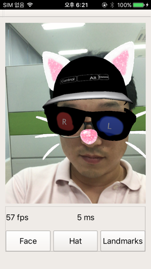

# AlMobile

* Version: 1c85d98c54135e70057fb5f051bc60dfca007e0d

## AlMobile 구성요소

* [alFace: 얼굴 Landmark 추적 모듈](/alface.md)
* [alFit: Head pose 추정 모듈](/alFit.md)
* \[alIris: 눈동자 추적 모듈\]\[alIris\]
* \[alGeom: 3D Deform 모듈\]\[alGeom\]
* \[alHand: 손 추적 모듈\]\[alHand\]

## 요구사항

* OpenCV 2.4.11 이상

## AlMobile 작동 화면

\| :----------------: \| :----------------: \|  
\|  \| !\[\]\[fig\_galaxy\_S3\] \|  
\|      iPhone SE     \|     Galaxy S3      \|

\[fig\_galaxy\_S3\]: figs/GalaxyS3.png "Galaxy S3"

