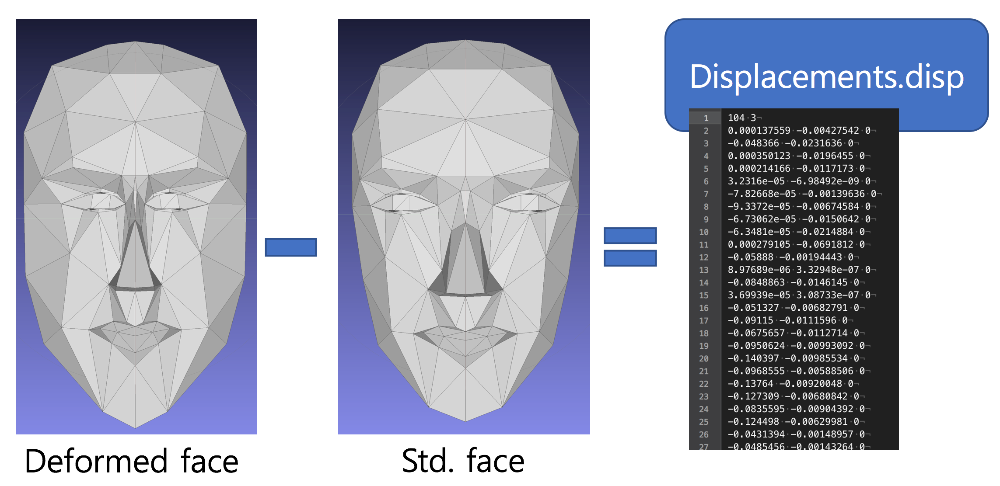

## alGeom Interface


### 구조체

* alMesh
  OpenGL style의 mesh로, vertex, normal, texture coordinate를 갖는다.
  아래와 같은 code처럼 사용하여 rendering 할 수 있다.

```cpp
glBindBuffer(GL_ARRAY_BUFFER, vertex_buffer);
glBufferData(GL_ARRAY_BUFFER, 3 * mymesh->num_vertices * sizeof(float),  mymesh->vertices, GL_STATIC_DRAW);

glBindBuffer(GL_ARRAY_BUFFER, normal_buffer);
glBufferData(GL_ARRAY_BUFFER, 3 * mymesh->num_vertices * sizeof(float), mymesh->normals, GL_STATIC_DRAW);

glBindBuffer(GL_ELEMENT_ARRAY_BUFFER, index_buffer);
glBufferData(GL_ELEMENT_ARRAY_BUFFER, 3 * mymesh->num_faces * sizeof(int), mymesh->indices, GL_STATIC_DRAW);
```

* alDeformationField
  성형을 위한 deformation field.

### Standard face 획득

* `alGetStatic3DFaceModel()`는 기존의 `alGet3DModelInfo()`를 대체할 수 있는 함수로, alMesh 타입의 standard face를 반환한다.

```cpp
auto stdFace = new alMesh;
alGetStatic3DFaceModel(stdFace);
```

### Deformation field 로드

* `alLoadDeformationField()`는 파일로부터 deformation field를 로드한다. deformation field는 standard face를 변형시킨 deformed face와의 difference를 기록한 파일이며, 다음과 같은 형식을 갖는다. standard face의 OBJ 형태는 `stdface.obj`로 존재한다.

* Deformation field 계산 방법  
  

```
104 3
x0 y0 z0
x1 y1 z1
...
xn yn zn
```

### Deformation field 적용

* `alApplyDeformationFieldToMesh()`함수는 앞에서 로드한 deformation field를 주어진 mesh에 적용한다. Deform된 mesh에 texture가 정확하게 입혀지기 위해서, deformation field를 적용하기 전 `alComputeTextureCoordinates4FaceDeform()`를 사용하여 texture coordinate를 미리 계산해 둔다.

```cpp
alComputeTextureCoordinates4FaceDeform(mesh, camera_matrix, modelViewMatrix, height, width, is270);

alApplyDeformationFieldToMesh(deformation_field, mesh);
```

### 그 외 함수들

* Memory

  * `void alAllocateFaceModel(alMesh *mesh, bool allocateVertex, bool allocateNormal, bool allocateTexCoords, bool allocateIndex)`  
    alMesh를 초기화한다. 필요한 부분만 초기화 하기 위하여 `allocateVertex`, `allocateNormal`, `allocateTexCoords`, `allocateIndex`를 설정한다.

  * `void alRelease3DFaceModel(alMesh* mesh)`  
    할당된 alMesh를 해제한다.

  * `void alCopyMesh(alMesh* dst, const alMesh* src)`  
    `src` mesh를 `dst` mesh로 복사한다.

  * `void alReleaseDeformationField(alDeformationField* displacements)`  
    Load한 deformation field를 해제한다.

* Geometry computation

  * `alMesh* alSubdivide(const alMesh* mesh)`  
    주어진 mesh를 subdivide한다.

  * `int alComputeNormal(alMesh* mesh)`  
    mesh의 normal을 계산한다.

  * `int alComputeTextureCoordinates(alMesh* mesh)`  
    mesh의 texture coordinate를 계산한다. 이 함수는 Face mesh위에 texture를 매핑하기 위하여 사용된다.

  * `int alComputeTextureCoordinates4FaceDeform(alMesh *mesh, const float *camera_matrix, const float *model_view_matrix, int width, int height, bool rotate270)`  
    형상 변형을 위한 texture coordinate를 계산한다. 형상 변형을 위해서는 `alComputeTextureCoordinates()`대신 이 함수를 사용한다. 이때의 texture는 카메라 영상이다.

* Replacements

  * `void alGetStatic3DFaceModel(alMesh* mesh, bool no_vertex_copy = false)`  
    `alGet3DModelInfo()`의 대체품, `no_vertex_copy`가 true이면 mesh 메모리 할당과 \(vertex array, index array\), face 정보만을 얻어온다.

  * `int alGetAnimatedFaceModel(int face_id, alMesh* mesh)`  
    `alGetAnimatedModel()`의 대체품.


